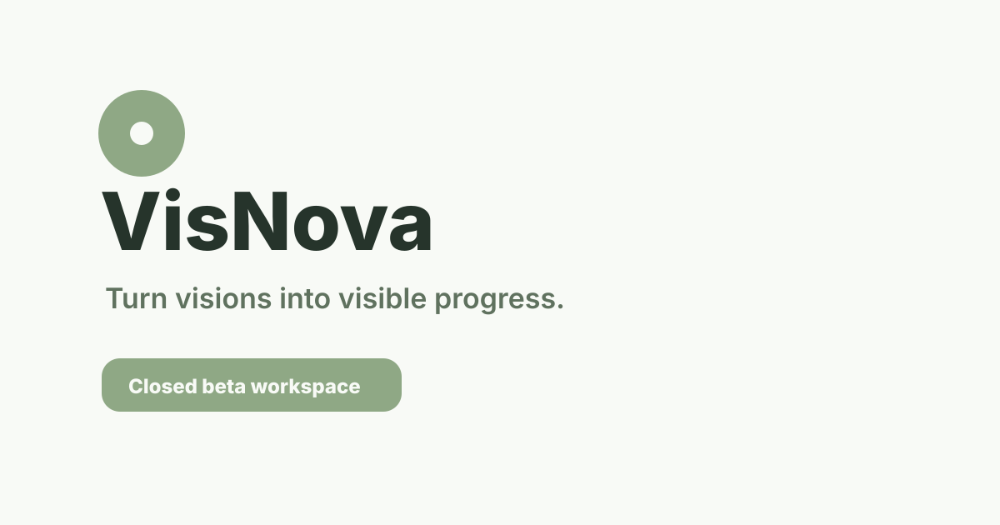

# 🌌 VisNova

<div align="center">



<br />

<h3>Turn visions into visible progress.</h3>

<p>
  <strong>VisNova</strong> is a vision-to-reality social productivity platform for ambitious builders.
</p>

<p>
  Set long-term goals, break them into tasks, track progress, write notes, reflect through journals, share updates, build your Circle, and stay accountable through public momentum.
</p>

<p>
  <a href="https://visnova.vercel.app"><strong>Production</strong></a>
  ·
  <a href="#features"><strong>Features</strong></a>
  ·
  <a href="#tech-stack"><strong>Tech Stack</strong></a>
  ·
  <a href="#getting-started"><strong>Getting Started</strong></a>
</p>

<br />


</div>

---

## Overview

VisNova is built around one simple idea:

> People become more consistent when their progress is visible.

Most productivity tools are private. They help users plan, but they rarely create accountability. Most social platforms are public, but they are noisy and distracting. VisNova connects both worlds.

It gives users a private workspace to plan their future and a public layer to share progress with people who are building alongside them.

The result is a platform where users do not just create goals. They turn those goals into visible execution.

---

## Product Preview

> Add real screenshots in `docs/screenshots/` and replace the placeholder paths below.

<div align="center">

| Dashboard | Vision Board |
|---|---|
|  |  |

| Journal | Feed |
|---|---|
|  |  |

</div>

Recommended screenshot files:

```txt
public/logo.png
public/og-image.svg
docs/screenshots/dashboard.png
docs/screenshots/vision-board.png
docs/screenshots/journal.png
docs/screenshots/feed.png
docs/screenshots/profile.png
```

---

## What VisNova Is

VisNova is a **goal-tracking and social learning platform** for people working on long-term ambitions.

It is designed for:

- students preparing for exams, careers, or admissions
- creators building an audience
- developers building projects
- founders building startups
- freelancers building skills
- ambitious people building a better life

VisNova helps users move from vague ambition to daily action.

The app connects:

- **Visions** for long-term goals
- **Tasks** for execution
- **Notes and Journal** for thinking and reflection
- **Feed** for public progress
- **Circle** for accountability
- **Communities** for shared interests
- **Nova Clock** for future-focused time capsules
- **Profiles** for identity and proof of progress

---

## Core Loop

```txt
Set Vision → Break into Tasks → Log Progress → Share with Circle → Get Inspired → Repeat
```

VisNova is not only a productivity app. It is a progress operating system.

---

## Features

### Vision System

Create long-term goals, organize them by category, and convert them into actionable execution plans.

Key capabilities:

- create and manage visions
- assign categories such as growth, career, lifestyle, money, plans, or custom
- track progress visually
- connect visions with tasks, notes, and public updates
- publish selected visions when the user wants accountability

### Tasks and Progress

VisNova turns ambition into small visible wins.

Key capabilities:

- create tasks linked to visions
- mark tasks as complete
- track execution progress
- build streaks and consistency
- show visible movement over time

### Vision Board

A visual planning canvas for arranging ideas, links, images, sticky notes, and direction.

Key capabilities:

- creative board-style planning
- draggable elements
- visual idea mapping
- resource links
- board persistence
- project-style planning for goals and life systems

### Notes and Journal

A thinking space for planning, reflection, and self-review.

Key capabilities:

- write structured notes
- organize notes into folders
- use daily journal entries
- reflect on personal progress
- capture lessons, ideas, and decisions

### Feed

A public progress layer built for accountability, not distraction.

Key capabilities:

- share progress updates
- post achievements, reflections, and build logs
- like, comment, and save posts
- discover people building similar things
- create proof of execution over time

### Circle

A social accountability layer for people who are building seriously.

Key capabilities:

- follow builders
- view public progress
- build a focused network
- stay accountable through visible execution

### Communities

Topic-based spaces for shared interests, learning, and momentum.

Examples:

- creators
- students
- developers
- founders
- productivity
- personal growth
- finance

### Nova Clock

A future-focused capsule system for storing thoughts, goals, and reflections that can be unlocked later.

Key capabilities:

- create time capsules
- lock personal reflections
- revisit future goals
- track how thinking changes over time

### Profile

A public identity layer built around progress, not vanity.

Key capabilities:

- profile identity
- avatar and bio
- public posts
- progress proof
- follower and following system

---

## Why VisNova Exists

People usually fail at big goals for three reasons:

1. Their goals stay vague.
2. Their progress stays invisible.
3. Their environment does not hold them accountable.

VisNova solves this by combining private execution with public proof.

Private side:

- visions
- tasks
- notes
- journals
- boards
- reflection

Public side:

- feed
- profiles
- communities
- Circle
- visible progress

This creates a system where users can plan deeply, execute daily, and build momentum publicly.

---

## Brand Direction

### Name

**VisNova** combines:

- **Vision** — long-term direction
- **Nova** — a bright burst of energy, progress, and transformation

Together, VisNova represents the process of turning invisible ambition into visible progress.

### Tagline

```txt
Turn visions into visible progress.
```

### Brand Personality

- focused
- premium
- ambitious
- modern
- builder-first
- future-facing
- calm but powerful

### Visual Direction

Recommended brand direction:

- deep dark interface
- soft gradients
- subtle glow
- glass-style panels
- clean typography
- minimal icons
- progress-first dashboards
- purple, blue, and cosmic accent tones

---

## Tech Stack

### Frontend

- React 19
- TypeScript
- Vite
- Tailwind CSS
- Zustand
- React Router
- Lucide React
- Motion
- Recharts
- dnd-kit
- react-zoom-pan-pinch

### Backend

- Supabase Auth
- Supabase Postgres
- Supabase Storage
- Supabase Row Level Security
- Supabase migrations

### Deployment

- Vercel
- Supabase Cloud

---

## Project Structure

```txt
VisNova/
├── docs/
│   ├── pre-launch-checklist-status.md
│   ├── security-audit-2026-05-09.md
│   └── supabase-auth-redirects.md
├── public/
│   ├── favicon.svg
│   └── og-image.svg
├── src/
│   ├── components/
│   │   ├── Auth/
│   │   ├── Circle/
│   │   ├── Community/
│   │   ├── Dashboard/
│   │   ├── Feed/
│   │   ├── Legal/
│   │   ├── Money/
│   │   ├── Notes/
│   │   ├── Nova/
│   │   ├── Onboarding/
│   │   ├── Settings/
│   │   ├── Social/
│   │   ├── Support/
│   │   └── VisionBoard/
│   ├── lib/
│   ├── services/
│   ├── store/
│   ├── types.ts
│   ├── App.tsx
│   └── main.tsx
├── supabase/
│   ├── README.md
│   └── migrations/
├── package.json
└── README.md
```

---

## Getting Started

### 1. Clone the repository

```bash
git clone https://github.com/naitik669/VisNova.git
cd VisNova
```

### 2. Install dependencies

```bash
npm install
```

### 3. Create environment file

Create a `.env.local` file in the root folder:

```env
VITE_SUPABASE_URL=your_supabase_project_url
VITE_SUPABASE_ANON_KEY=your_supabase_anon_or_publishable_key
VITE_APP_URL=http://localhost:5173
```

### 4. Run locally

```bash
npm run dev
```

### 5. Build for production

```bash
npm run build
```

---

## Supabase Setup

VisNova uses Supabase for authentication, database, storage, and security.

Before running the app fully, configure:

- Supabase project URL
- Supabase anon or publishable key
- database migrations
- storage buckets
- auth providers
- redirect URLs
- row-level security policies

For Google Auth, the Google Cloud authorized redirect URI should point to Supabase:

```txt
https://YOUR_PROJECT_REF.supabase.co/auth/v1/callback
```

Supabase redirect URLs should include:

```txt
http://localhost:5173/auth/callback
https://your-production-domain.com/auth/callback
```

---

## Available Scripts

```bash
npm run dev       # Start local development server
npm run build     # Create production build
npm run preview   # Preview production build locally
npm run lint      # Run lint checks
```

---

## Beta Launch Status

VisNova is currently being prepared for a closed beta release.

Beta priorities:

- stable login and onboarding
- clean Google OAuth flow
- reliable vision and task creation
- smooth Vision Board interactions
- persistent notes and journals
- working feed and profile system
- secure Supabase RLS policies
- mobile-ready layouts
- feedback collection
- lightweight beta analytics

Closed beta goal:

```txt
20–50 focused users testing the full progress loop.
```

---

## Security and Privacy

VisNova stores private user data such as notes, journals, goals, and personal progress. Security is treated as a core product requirement.

Security principles:

- private notes stay private
- private journals stay private
- private capsules stay private
- users cannot modify other users’ private data
- public posts and public profiles are intentionally visible
- analytics must not store private content
- storage buckets must follow the correct public/private rules

See:

```txt
docs/security-audit-2026-05-09.md
```

---

## Roadmap

### Current Focus

- closed beta stabilization
- Google login reliability
- onboarding polish
- Vision Board interaction fixes
- Journal customization
- mobile experience
- feedback loop
- performance optimization

### Future Direction

- richer progress history
- weekly growth reports
- stronger community spaces
- better public proof-of-progress profiles
- smarter recommendations
- deeper analytics
- advanced collaboration
- AI-assisted planning and reflection

---

## Contributing

VisNova is currently in private development and closed beta preparation.

If you are contributing internally:

1. Create a separate branch.
2. Keep changes focused.
3. Do not rewrite existing architecture without approval.
4. Run lint and build checks before pushing.
5. Avoid exposing private keys or Supabase secrets.
6. Keep migrations safe and non-destructive.

Recommended branch format:

```txt
fix/auth-google-oauth
feature/vision-board-resize
polish/beta-mobile-layout
```

---

## Branding Assets

Recommended asset locations:

```txt
public/logo.png
public/logo.svg
public/favicon.svg
public/og-image.svg
docs/screenshots/dashboard.png
docs/screenshots/vision-board.png
docs/screenshots/journal.png
docs/screenshots/feed.png
```

Logo usage:

- use the full VisNova wordmark for official pages
- use the icon mark for favicon, mobile, and compact UI
- keep enough padding around the logo
- avoid placing the logo on noisy backgrounds
- prefer dark, premium, high-contrast layouts

---

## Terms

This repository and product are part of the VisNova project. The app, interface, codebase, branding, visual identity, product concept, copy, and related assets are protected by copyright and intellectual property rights.

You may not copy, redistribute, resell, rebrand, or commercially use any part of VisNova without written permission from the owner.

For public users, VisNova’s usage terms and privacy rules should be reviewed inside the deployed application once the legal pages are finalized.

---

## Copyright

<div align="center">

**© 2026 VisNova. All rights reserved.**

Built for people turning ambition into visible execution.

</div>
